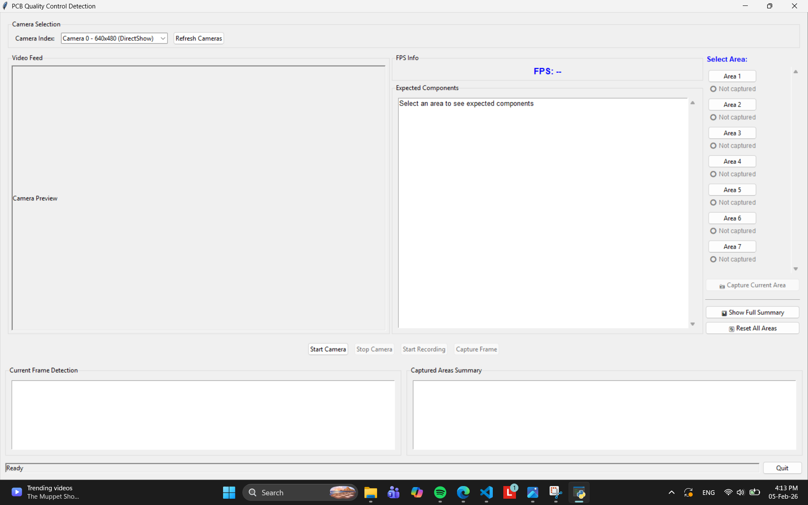
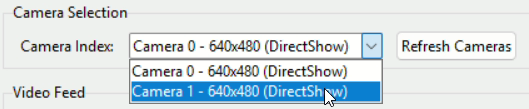
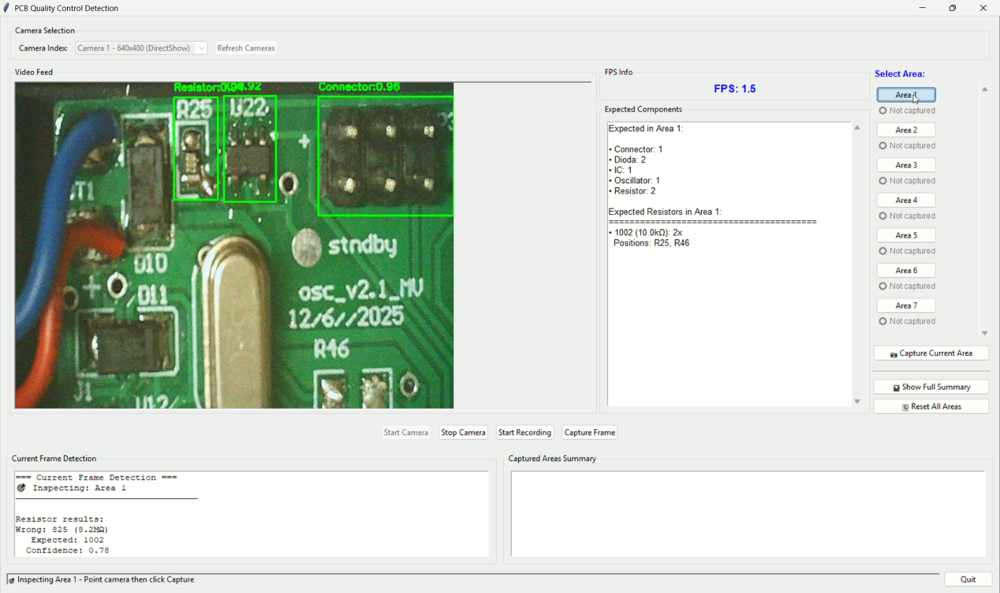

# PCB_QualityControl
Quality control used for PCB by using deep learning (YOLOv8) due to fulfill my Kerja Praktik project

# For Windows User
On branch `main`, clone this repository with Windows Powershell or Terminal
```
git clone --branch main https://github.com/catSushiRoll/PCB_QualityControl.git
cd ./PCB_QualityControl
pip install -r requirements.txt
```
# Table of Contents
Here are lists of all scripts used to perfecting the code for detection
|Program            |Location                |Function                                          |
|---------------------|------------------------|------------------------------------------------|
|`area_rules.py`                 |./PCB_QualityControl    |Listing all components that exist for each area                          |
|`cam_detection.py`              |./PCB_QualityControl    |Detects all cameras that connected to the device                         |
|`conf_detection_gui.py`         |./PCB_QualityControl    |Main program for detects components using YOLOv8 with GUI                |
|`conf_detection_with_ocr.py`    |./PCB_QualityControl    |Main program for detects components using YOLOv8 + OCR with GUI          |
|`filtering_area.py`             |./PCB_QualityControl    |Filtering object detected that should be displayed if an area selected   |
|`ocr_resistor.py`               |./PCB_QualityControl    |Optical Character Recognition (OCR) program for reading resistor's value |

# How to Use the GUI
Run this on terminal
```
cd ./PCB_QualityControl
python conf_detection_with_ocr.py
```
And the GUI will appear like the picture below

Select the camera used for take the frame

Click the button for detect each area

If all of the components are already detected, click the `Capture Current Area`. Do this for all areas and then get the summary by clicking `Show Full Summary`.